#V1

##CPU GET

На графике видно:
1) Старт треда селектора начинается параллельно со стартом JIT процесса, который потребляет треть всех ресурсов, потому что процесс еще не оптмимизирован.
2) Дебаг логирование потребляет 17% ресурсов.
3) Логика DAO потребляет всего 10%, но некторые все таки находят свое value. Слишком поздно запустил тетирование, инкремент ключа сильно вырос и большая часть ключей по запросам не найдена.
4) Так же видно системные вызовы.

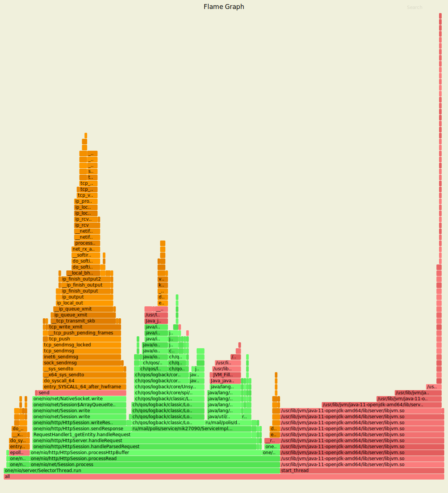

##CPU PUT

На графике видно:
1) JIT процесс потребляет всего 1.5%, процесс успел достаточно оптимизироваться.
2) Логгер снова жрет аж 23%.
3) Логика DAO всего лишь 3%, так мало скорей всего из-за того, что на сервер было отправлено недостаточное количество данных для флеша на диск, в этом случае потребление выростит в разы.
4) Появили процессы обработки реквеста и реквест боди.
4) Так же видно системные вызовы.

##ALLOC GET
Учитывая заммечания в CPU тесте просто опишу куда уходит большая часть ресурсов. 
1) DAO 5%, видимо совсем мало обстреливал.
2) Дебагг 51%
3) Чтение из сокета 11%
4) остальное получение хедеров, парсинг реквеста, иницилизация респонсна и его отправка.

##ALLOC PUT
Учитывая заммечания в CPU тесте просто опишу куда уходит большая часть ресурсов. 
1) DAO 33%
2) Логгер 37%
3) Остальное парсинг реквеста, иницилизирование респонса, жонглирование байт буфферами.

#UPDATE!

#V2

##CPU GET

1) Процесс прогрет
2) Не тратим цпу на логгирование
3) Перед профилированием сторач наполнен

##CPU PUT

1) Появился флаш

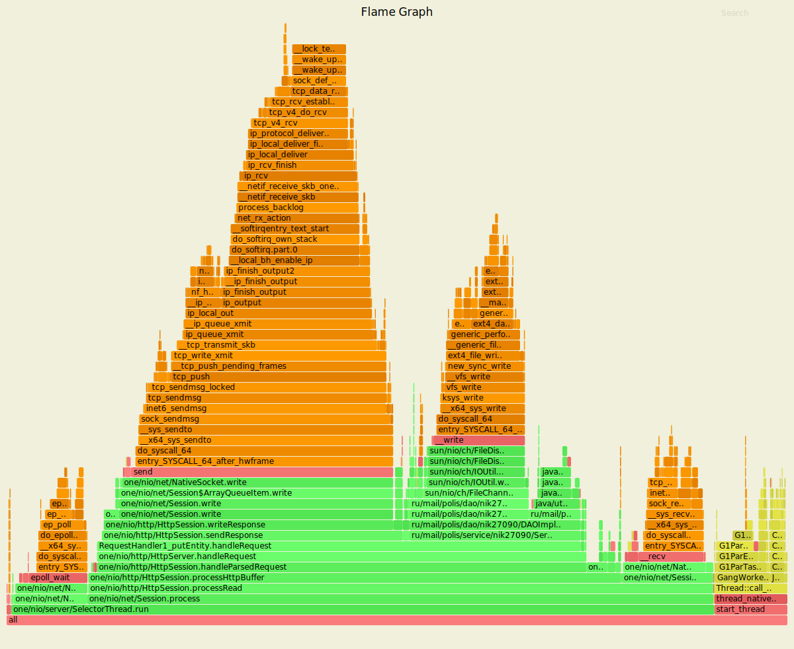

##ALLOC GET

##ALLOC PUT

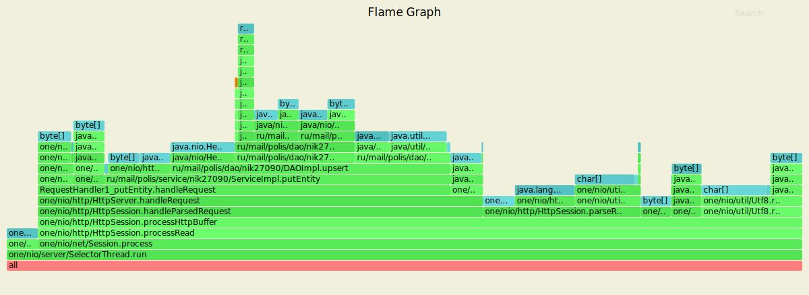

#Результаты wkr2: 

##GET

    wrk -t1 -c1 -d5m -R2000 --latency -s wrk2/getScript.lua http://127.0.0.1:8080
    Running 5m test @ http://127.0.0.1:8080
      1 threads and 1 connections
      Thread calibration: mean lat.: 7.678ms, rate sampling interval: 42ms
      Thread Stats   Avg      Stdev     Max   +/- Stdev
        Latency   133.54ms  294.69ms   1.21s    86.04%
        Req/Sec     2.01k   473.12     4.80k    74.63%
      Latency Distribution (HdrHistogram - Recorded Latency)
     50.000%    3.32ms
     75.000%   20.37ms
     90.000%  694.78ms
     99.000%    1.07s 
     99.900%    1.19s 
     99.990%    1.21s 
     99.999%    1.21s 
    100.000%    1.21s
    #[Mean    =      133.544, StdDeviation   =      294.695]
    #[Max     =     1212.416, Total count    =       322016]
    #[Buckets =           27, SubBuckets     =         2048]
    ----------------------------------------------------------
      342024 requests in 2.87m, 24.02MB read
    Requests/sec:   1988.42
    Transfer/sec:    143.01KB 

##PUT

    wrk -t1 -c1 -d5m -R2000 --latency -s wrk2/putScript.lua http://127.0.0.1:8080
    Running 5m test @ http://127.0.0.1:8080
    1 threads and 1 connections
    Thread calibration: mean lat.: 1.003ms, rate sampling interval: 10ms
    Thread Stats   Avg      Stdev     Max   +/- Stdev
    Latency     8.86ms   79.34ms   1.26s    98.79%
    Req/Sec     2.11k     1.11k   61.11k    98.58%
    Latency Distribution (HdrHistogram - Recorded Latency)
    50.000%    0.98ms
    75.000%    1.34ms
     90.000%    1.68ms
     99.000%  282.11ms
     99.900%    1.11s 
     99.990%    1.24s 
     99.999%    1.26s 
    100.000%    1.26s
    #[Mean    =      133.544, StdDeviation   =      294.695]
    #[Max     =     1212.416, Total count    =       322016]
    #[Buckets =           27, SubBuckets     =         2048]
    ----------------------------------------------------------
      342024 requests in 2.87m, 24.02MB read
    Requests/sec:   1988.42
    Transfer/sec:    143.01KB
    
###TASK_3

##PUT

    wrk -t4 -c16 -d40s -R10000 --latency -s wrk2/putScript.lua http://127.0.0.1:8080
    
    Running 40s test @ http://127.0.0.1:8080
      4 threads and 16 connections
      Thread Stats   Avg      Stdev     Max   +/- Stdev
        Latency   701.20us  398.11us  11.06ms   69.61%
        Req/Sec     2.58k   146.61     4.55k    77.68%
      Latency Distribution (HdrHistogram - Recorded Latency)
     50.000%  684.00us
     75.000%    0.98ms
     90.000%    1.15ms
     99.000%    1.34ms
     99.900%    4.43ms
     99.990%    8.06ms
     99.999%   10.06ms
    100.000%   11.07ms
    #[Mean    =        0.701, StdDeviation   =        0.398]
    #[Max     =       11.064, Total count    =       299791]
    #[Buckets =           27, SubBuckets     =         2048]
    ----------------------------------------------------------
      399919 requests in 40.00s, 25.55MB read
    Requests/sec:   9998.20
    Transfer/sec:    654.18KB

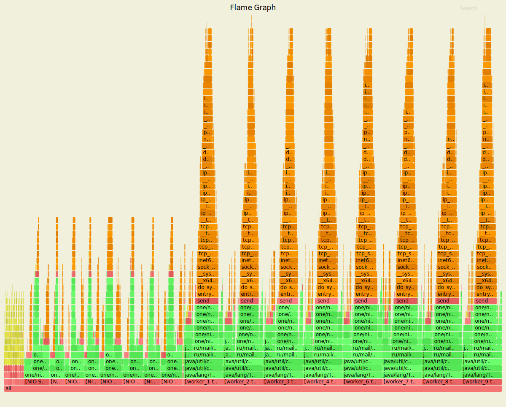

###GET

    wrk -t4 -c16 -d40s -R10000 --latency -s wrk2/getScript.lua http://127.0.0.1:8080
    
    Running 40s test @ http://127.0.0.1:8080
      4 threads and 16 connections
      Thread Stats   Avg      Stdev     Max   +/- Stdev
        Latency    12.12s     4.54s   19.86s    57.85%
        Req/Sec     1.18k    19.89     1.21k    50.00%
      Latency Distribution (HdrHistogram - Recorded Latency)
     50.000%   12.22s 
     75.000%   16.06s 
     90.000%   18.35s 
     99.000%   19.69s 
     99.900%   19.84s 
     99.990%   19.86s 
     99.999%   19.87s 
    100.000%   19.87s 
    #[Mean    =    12121.006, StdDeviation   =     4537.780]
    #[Max     =    19857.408, Total count    =       142173]
    #[Buckets =           27, SubBuckets     =         2048]
    ----------------------------------------------------------
      201494 requests in 40.00s, 13.95MB read
    Requests/sec:   5037.42
    Transfer/sec:    357.05KB

#TASK_4

##PUT

    wrk -t4 -c32 -d40s -R10000 --latency -s wrk2/putScript.lua http://127.0.0.1:8080
    Running 40s test @ http://127.0.0.1:8080
      4 threads and 32 connections
      Thread calibration: mean lat.: 0.853ms, rate sampling interval: 10ms
      Thread calibration: mean lat.: 0.862ms, rate sampling interval: 10ms
      Thread calibration: mean lat.: 0.833ms, rate sampling interval: 10ms
      Thread calibration: mean lat.: 0.870ms, rate sampling interval: 10ms
      Thread Stats   Avg      Stdev     Max   +/- Stdev
        Latency   847.84us  610.21us  26.70ms   91.97%
        Req/Sec     2.58k   193.96     8.33k    89.22%
      Latency Distribution (HdrHistogram - Recorded Latency)
     50.000%  822.00us
     75.000%    1.11ms
     90.000%    1.32ms
     99.000%    1.66ms
     99.900%    7.45ms
     99.990%   20.90ms
     99.999%   24.58ms
    100.000%   26.72ms
    
    #[Mean    =        0.848, StdDeviation   =        0.610]
    #[Max     =       26.704, Total count    =       299594]
    #[Buckets =           27, SubBuckets     =         2048]
    ----------------------------------------------------------
      399829 requests in 40.00s, 29.28MB read
    Requests/sec:   9995.88
    Transfer/sec:    749.47KB

В данной конфигурацией за 40 сек было выполнено 399829 запросов. В среднем по 25800 req/sec и с задержкой в 848us.
99.9% запросов были выполнены с задержкой меньше 7.45ms. 99% с задержкой меньше 1.66ms. Это Отличный показатель.
По сравнению с предыдущей реализацией задержка 99% перцентили увеличилась на 24%. А 99.9% перцентили на 68%.
Вывод: увеличение объема хранилища нашим методом, сильно увеличивает задержку ответа сервера. 

###CPU 

На данных графиках появился метод 'proxy'(19%), который переадресовывает запрос на соответсвующую ноду кластера.
Также можно заметить процесс 'getRightNodeForKey''(1%), который сортирует результат конкатенации хэшов ключа и ноды, выбирая ноду на которую будут записаны данные.

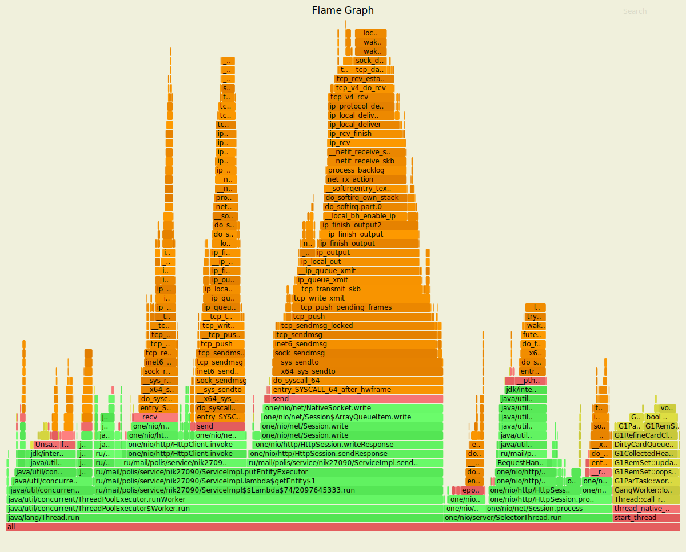

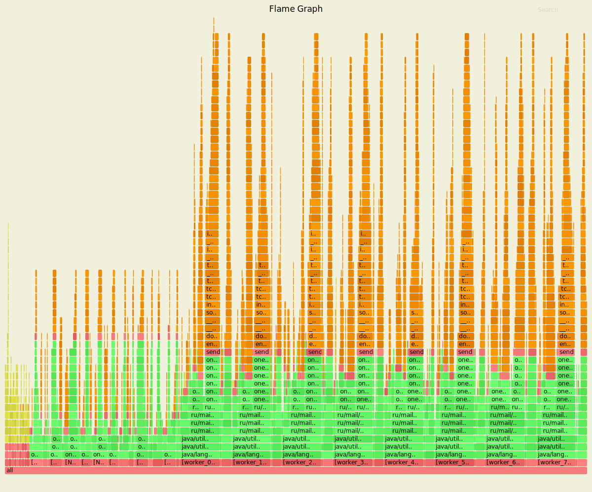

###ALLOC

Аналогично графикам CPU можно также заметить новые графы, 'proxy' - 23%, 'getRightNodeForKey' - 17%.

Вывод: Увеличение времени ответа сервера по-большей части из-за proxy метода. При мало количестве нод метод рандеву хэширования использовать целесообразно, но даже при таком кол-ве нод метод хэширования съедает почти пятую часть памяти.

###LOCK

Блокировки возникают на очереди между селекторами HTTP сервера и пулом потоков-воркеров.

##GET

    wrk -t4 -c32 -d40s -R10000 --latency -s wrk2/getScript.lua http://127.0.0.1:8080
    Running 40s test @ http://127.0.0.1:8080
      4 threads and 32 connections
      Thread calibration: mean lat.: 0.999ms, rate sampling interval: 10ms
      Thread calibration: mean lat.: 0.975ms, rate sampling interval: 10ms
      Thread calibration: mean lat.: 0.959ms, rate sampling interval: 10ms
      Thread calibration: mean lat.: 0.960ms, rate sampling interval: 10ms
      Thread Stats   Avg      Stdev     Max   +/- Stdev
        Latency   842.52us  657.98us  20.24ms   95.18%
        Req/Sec     2.57k   209.39     7.78k    91.13%
      Latency Distribution (HdrHistogram - Recorded Latency)
     50.000%  814.00us
     75.000%    1.10ms
     90.000%    1.30ms
     99.000%    1.59ms
     99.900%   11.84ms
     99.990%   18.00ms
     99.999%   20.01ms
    100.000%   20.25ms
    #[Mean    =        0.843, StdDeviation   =        0.658]
    #[Max     =       20.240, Total count    =       299593]
    #[Buckets =           27, SubBuckets     =         2048]
    ----------------------------------------------------------
      399822 requests in 40.00s, 31.48MB read
    Requests/sec:   9995.60
    Transfer/sec:    805.95KB

В данной конфигурацией за 40 сек было выполнено 399822 запроса. В среднем по 25700 req/sec и с задержкой в 843us.
99.9% запросов были выполнены с задержкой меньше 11.84ms. 99% с задержкой меньше 1.59ms. Это Отличный показатель.
По сравнению с предыдущей реализацией разница колоссальная. Скорей всего из-за не правильно произведенного тестирования на прошлом этапе. 
    
###CPU 

Аналогично результатам PUT запроса на графиках появились методы навигации запроса к нужной ноде.
hashing(0.5%), proxy(19%)

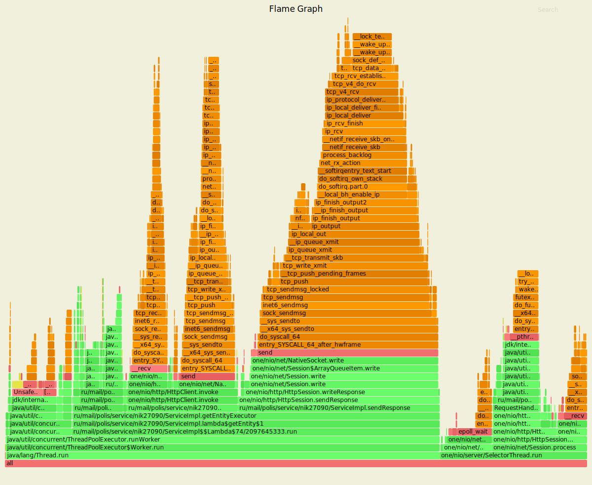

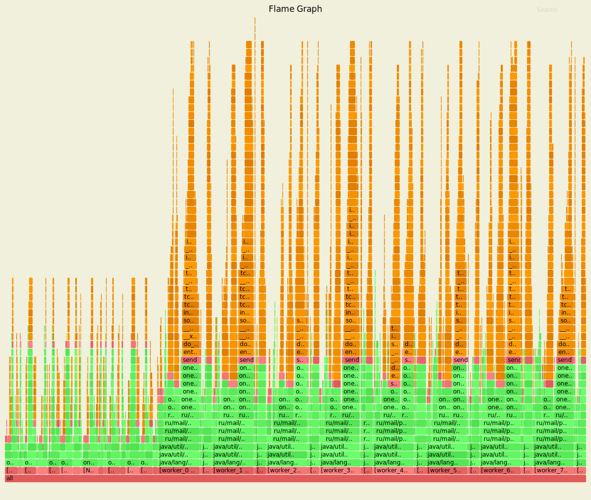

###ALLOC

Аналогично результатам PUT запроса на графиках появились методы навигации запроса к нужной ноде.
hashing(4.5%), proxy(19%)

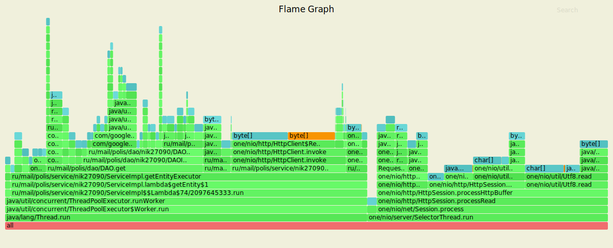

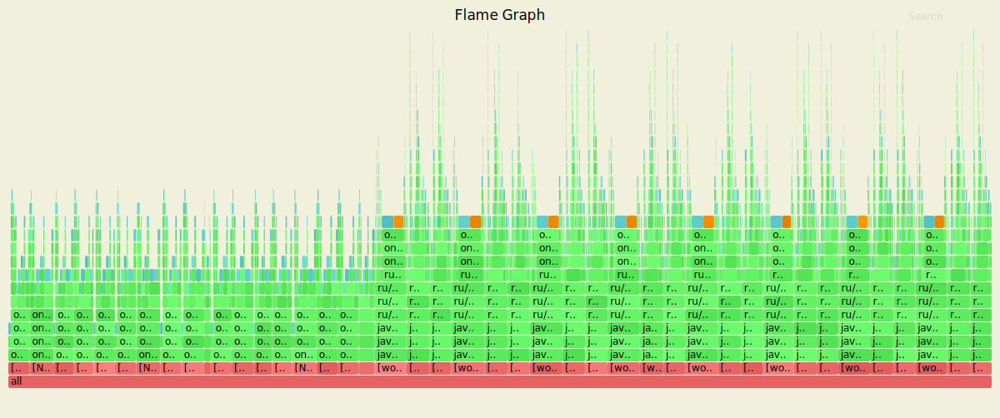

###LOCK

Блокировки возникают на очереди между селекторами HTTP сервера и пулом потоков-воркеров.

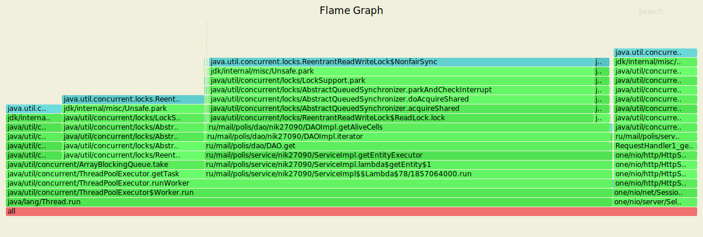

###ВЫВОД

При увеличении размера кластера таким методом нужно будет платить повышенными временными затратами на обработку и переадресацию запросов к нужной ноде и увеличенным потребление RAM. 

#TASK_5

##PUT

    wrk -t4 -c32 -d40s -R10000 --latency -s wrk2/putScript.lua http://127.0.0.1:8080
    Running 40s test @ http://127.0.0.1:8080
      4 threads and 32 connections
      Thread calibration: mean lat.: 1.831ms, rate sampling interval: 10ms
      Thread calibration: mean lat.: 1.899ms, rate sampling interval: 10ms
      Thread calibration: mean lat.: 1.857ms, rate sampling interval: 10ms
      Thread calibration: mean lat.: 1.809ms, rate sampling interval: 10ms
      Thread Stats   Avg      Stdev     Max   +/- Stdev
        Latency     1.97ms    2.25ms  26.93ms   94.38%
        Req/Sec     2.65k   498.55     8.11k    88.68%
      Latency Distribution (HdrHistogram - Recorded Latency)
     50.000%    1.46ms
     75.000%    2.11ms
     90.000%    3.09ms
     99.000%   13.77ms
     99.900%   21.76ms
     99.990%   25.04ms
     99.999%   26.48ms
    100.000%   26.94ms
    
    #[Mean    =        1.973, StdDeviation   =        2.249]
    #[Max     =       26.928, Total count    =       299589]
    #[Buckets =           27, SubBuckets     =         2048]
    ----------------------------------------------------------
      399820 requests in 40.00s, 25.55MB read
    Requests/sec:   9995.44
    Transfer/sec:    654.00KB
    
99.9% запросов были выполнены с задержкой меньше 21.76ms, задрежка почти в 3 раза больше, чем в предыдущей реализации.
99% запросов были выполнены с задержкой меньше 13.77ms, задержка больше в 8 раз, чем на прошлом этапе.
Вывод: увеличение надежности в разы увеличивает время ответа сервера. Но показатели перцентиль все еще в норме.

###CPU

На грфике видно ряд новых методов. В основном это вынос старого(чуть-чуть улучшенного функционала).
Новый метод 'getResponseFromNode', отвечающий за отправку запросов на все ноды и аккамулированию ответов сервера занимает 31% CPU.
Скорей всего именно из-за метода 'getResponseFromNode' увеличилось время ответа сервера.

###ALLOC

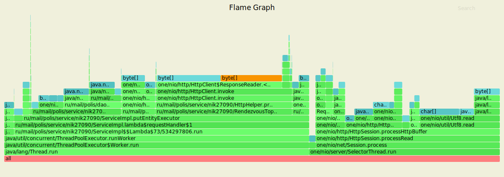

Аналогично графику CPU. Под метод 'getResponseFromNode' выделяется 28%.

###LOCK

Блокировки возникают на очереди между селекторами HTTP сервера и пулом потоков-воркеров.

##GET

    wrk -t4 -c32 -d40s -R10000 --latency -s wrk2/getScript.lua http://127.0.0.1:8080
    Running 40s test @ http://127.0.0.1:8080
      4 threads and 32 connections
      Thread calibration: mean lat.: 1.746ms, rate sampling interval: 10ms
      Thread calibration: mean lat.: 1.736ms, rate sampling interval: 10ms
      Thread calibration: mean lat.: 1.773ms, rate sampling interval: 10ms
      Thread calibration: mean lat.: 1.751ms, rate sampling interval: 10ms
      Thread Stats   Avg      Stdev     Max   +/- Stdev
        Latency     1.88ms    1.16ms  28.56ms   80.93%
        Req/Sec     2.64k   321.88     6.20k    75.75%
      Latency Distribution (HdrHistogram - Recorded Latency)
     50.000%    1.65ms
     75.000%    2.32ms
     90.000%    3.20ms
     99.000%    6.08ms
     99.900%   11.04ms
     99.990%   16.15ms
     99.999%   19.60ms
    100.000%   28.58ms
    
    #[Mean    =        1.883, StdDeviation   =        1.165]
    #[Max     =       28.560, Total count    =       299568]
    #[Buckets =           27, SubBuckets     =         2048]
    ----------------------------------------------------------
      399793 requests in 40.00s, 43.91MB read
    Requests/sec:   9994.88
    Transfer/sec:      1.10MB
    
99.9% запросов были выполнены с задержкой меньше 16.15ms, задрежка на 35% больше, чем в предыдущей реализации.
99% запросов были выполнены с задержкой меньше 6.08ms, задержка больше в 4 раз, чем на прошлом этапе.
Вывод: увеличение надежности в разы увеличивает время ответа сервера. Но показатели перцентиль все еще в норме.

###CPU

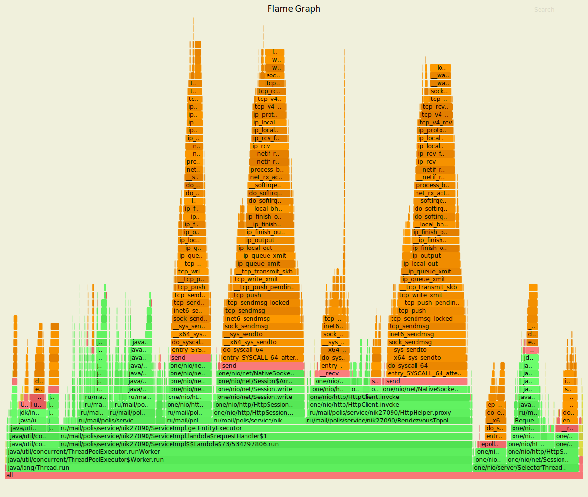

На грфике видно ряд новых методов. В основном это вынос старого(чуть-чуть улучшенного функционала).
Новый метод 'getResponseFromNode', отвечающий за отправку запросов на все ноды и аккамулированию ответов сервера занимает 29% CPU.
Скорей всего именно из-за метода 'getResponseFromNode' увеличилось время ответа сервера.

###ALLOC

Аналогично графику CPU. Под метод 'getResponseFromNode' выделяется 15%.

###LOCK

Блокировки возникают на очереди между селекторами HTTP сервера и пулом потоков-воркеров.
